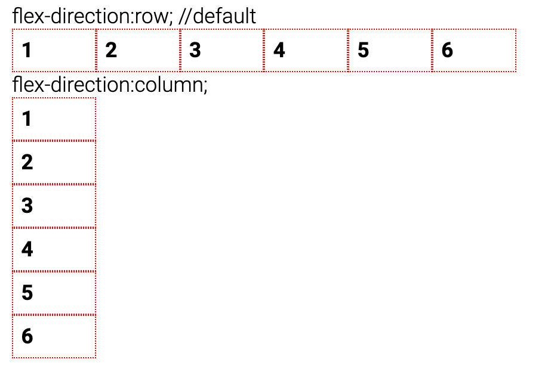
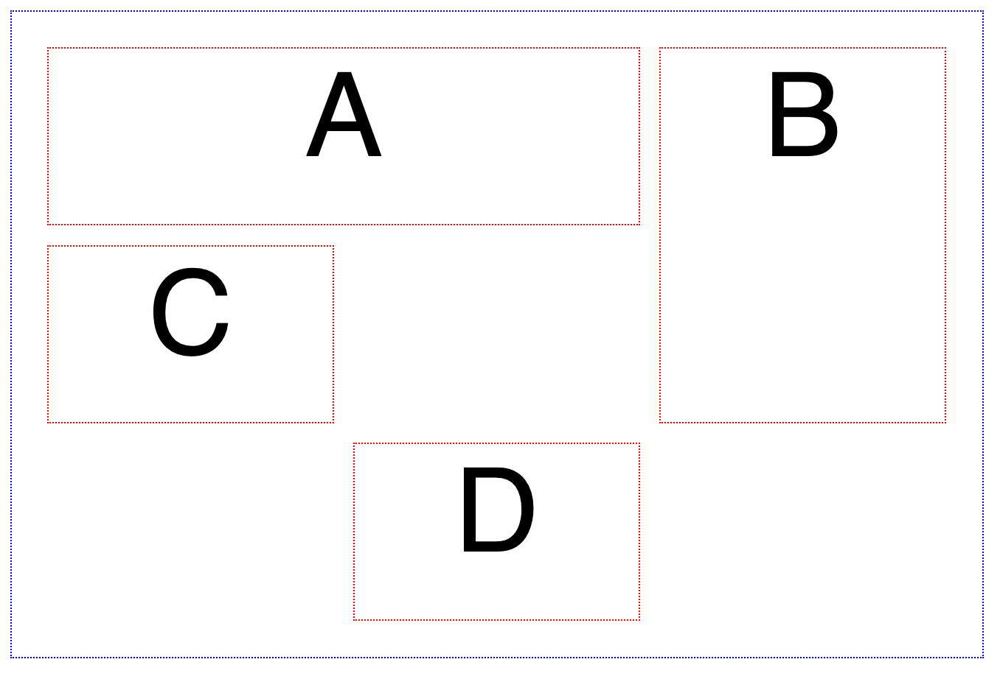
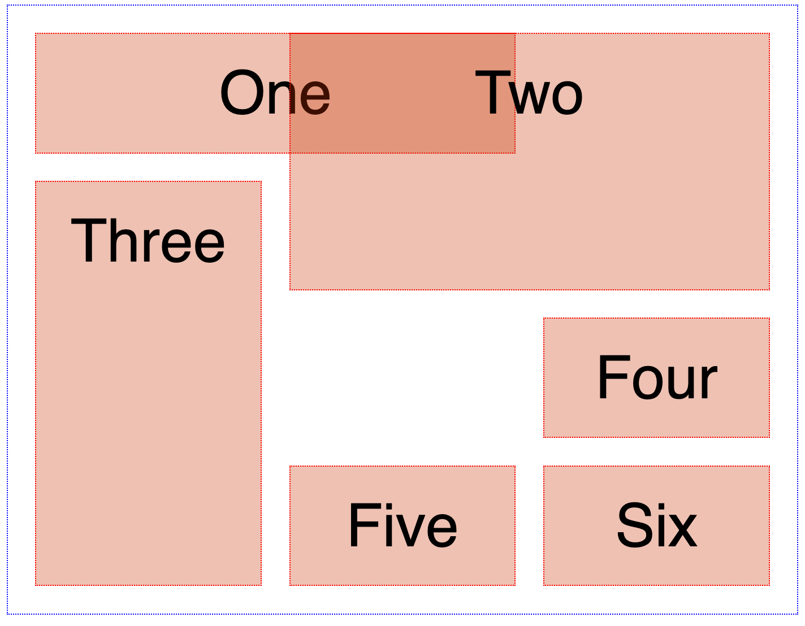
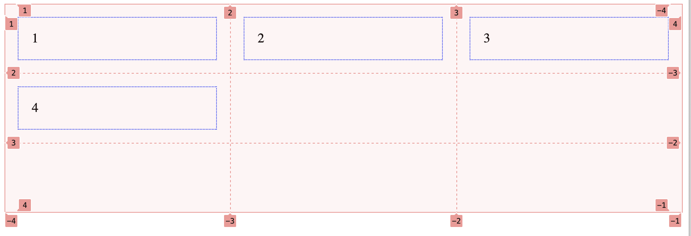
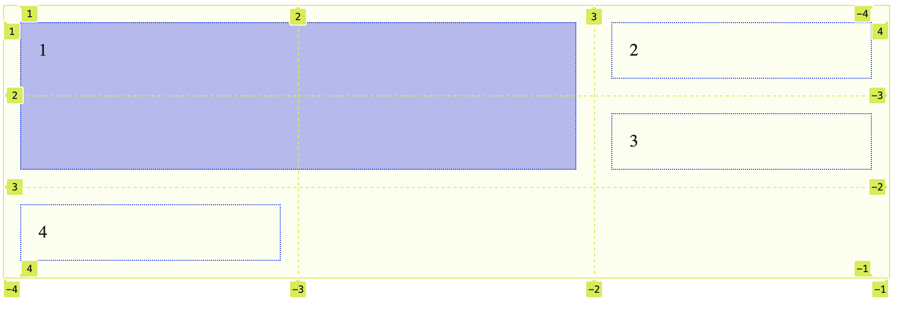

# Mehrspaltiges Layout HTML und CSS
## Flexibilität
> The control which designers know in the print medium, and often desire in the web medium, is simply a function of the limitation of the printed page. We should embrace the fact that the web doesn’t have the same constraints, and design for this flexibility. But first, we must 'accept the ebb and flow of things'. <br/>
https://alistapart.com/article/responsive-web-design/
***
Es gibt mehrere Arten, Mehrspaltigkeit und Flexibilität in HTML und CSS zu bauen:
* float -> brauchen wir nicht mehr 
* flexbox
* grid 

# Übersicht Konzepte
## Flexbox
Grundsätzlich erlaubt euch Flexbox, Elemente in eine Richtung anzuordnen: Entweder in Zeilen oder in Spalten. Flexbox bietet euch viele Möglichkeiten flexibel (daher der Name) mit dem vorhandenen Platz umzugehen und einfach responsive Layouts zu bauen. <br/><br/>
<br/>

## Grid
Im Unterschied zu Flexbox ist bei Grid die Alignierung über Zeilen und Spalten möglich – also in zwei Richtungen. 
<br/><br/>
<br/>
Mit Grid sind auch Überlagerungen von Elementen möglich (mit Flexbox alleine nicht). 
<br/><br/>
<br/>

# Einführung Grid 
In unserem Modul werden wir uns etwas ausführlicher mit Grid als mit Flexbox beschäftigen, da das Konzept im Rahmen unserer gestalterisch-typografischen Aufgabe viel Möglichkeiten bietet.
Die Property `display:grid` wird für das Parent Element gesetzt. Dann wird der Raster (Anzahl und Breite von Zeilen und Spalten)
```css
.parentcontainer{
    display:grid; 
    grid-template-columns: 1fr 1fr 1fr; /* 3 Spalten fr für fraction */
    grid-template-rows: 1fr 1fr 1fr; /* 3 Zeilen */
}
.child{
    border:1px dotted blue;
    padding:1rem;
    margin:1rem;
}
```
```html
<div class="parentcontainer">
    <div class="child">1</div>
    <div class="child">2</div>
    <div class="child">3</div>
    <div class="child">4</div>
</div
```
<br/>
<br/>
Standardmässig werden die Kindelemente von links nach rechts und oben nach unten eingefüllt. 
Im Chrome und im Firefox kann man sich den Grid anzeigen lassen. Die Spalten und Zeilen sind durchnummeriert, die Nummern beginnen bei 1. Die Kindelemente können aber auch explizit platziert werden. Die Angaben `grid-column: 1 / 3;` und `grid-row: 1 / 3;` beziehen sich auf die Nummern der Spalten und Zeilen. Das Element soll den Grid von Spalte 1 bis 3 ausfüllen. Der sogenannte Pseudo-Selektor `:nth-of-type(n)` erlaubt, ein Kindelement nach seiner Reihenfolge auszuwählen, ohne dass man spezielle Klassen erstellen muss.

```css
.child:nth-of-type(1) {
            grid-column: 1 / 3;
            grid-row: 1 / 3;
            /* grid-area: 1 / 3 / 1 / 3; Kurzschreibweise Area */
            background-color:rgba(0,0,255,0.3)
        }
```
<br/>
<br/>

Kurzübung: Erstellt dieses Bild von Piet Mondrian mit einem Grid. 

