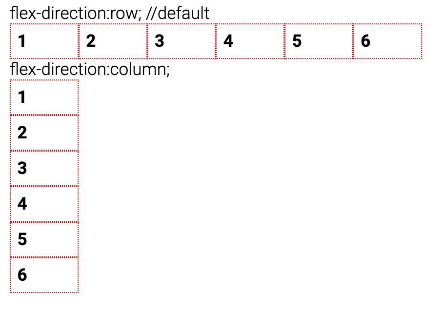
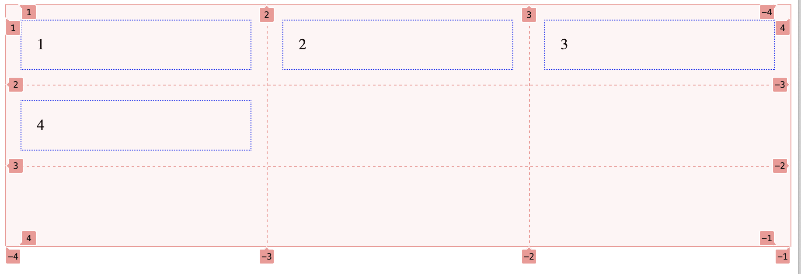
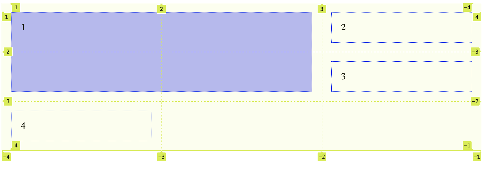

# Mehrspaltiges Layout HTML und CSS
## Mehrspaltigkeit
Lange war es gar nicht so einfach, ein mehrspaltiges Layout in HTML und CSS zu bauen. 
Im Laufe der Entwicklung gab es verschiedene Konzepte und Vorschläge. Am Anfang arbeitete man mit Tabellen, später mit `float`. Heute haben wir mit Flexbox und Grid zwei Konzepte, die wirklich fürs Layout entwickelt wurden (Tabelle war das nicht) und die robust sind (float war das nicht). Die beiden Konzepte sind kombinierbar und haben je ihre Stärken. Heute schauen wir Grid vertiefter an als Flexbox, flexbox am 11.11.

## Flexibilität
> The control which designers know in the print medium, and often desire in the web medium, is simply a function of the limitation of the printed page. We should embrace the fact that the web doesn’t have the same constraints, and design for this flexibility. But first, we must 'accept the ebb and flow of things'. <br/>
https://alistapart.com/article/responsive-web-design/

<br/>

Flexibilität im Raster, den Proportionen und Grössen erlaubt, mit unterschiedlichen Ausgabegeräten optimal umzugehen. Das bedeutet, so wenig wie möglich fixe Masse für das Layout zu benutzen und stattdessen mit `%`, `vw` oder `fr` (fraction) zu arbeiten. 
Flexibilität alleine genügt nicht, um eine optimales Nutzererlebnis auf allen Geräten zu schaffen, für grosse Unterschiede ist eine Umgruppierung des Layouts notwendig. Dafür benutzen wir sogenannten media queries. Das behandeln wir am 11.11.

<br/><br/>


***


# Übersicht Konzepte
## Flexbox
Grundsätzlich erlaubt euch Flexbox, Elemente in eine Richtung anzuordnen: Entweder in Zeilen oder in Spalten. Flexbox bietet euch viele Möglichkeiten flexibel (daher der Name) mit dem vorhandenen Platz umzugehen und einfach responsive Layouts zu bauen. <br/><br/>
<br/>

## Grid
Im Unterschied zu Flexbox ist bei Grid die Alignierung über Zeilen und Spalten möglich – also in zwei Richtungen. 
<br/><br/>
<br/>
Mit Grid sind auch Überlagerungen von Elementen möglich (mit Flexbox alleine nicht). 
<br/><br/>
<br/>

# Einführung Grid 
In unserem Modul werden wir uns etwas ausführlicher mit Grid als mit Flexbox beschäftigen, da das Konzept im Rahmen unserer gestalterisch-typografischen Aufgabe viel Möglichkeiten bietet.
Die Property `display:grid` wird für das Parent Element gesetzt. Dann wird der Raster (Anzahl und Breite von Zeilen und Spalten)
```css
.parentcontainer{
    display:grid; 
    grid-template-columns: 1fr 1fr 1fr; /* 3 Spalten fr für fraction */
    grid-template-rows: 1fr 1fr 1fr; /* 3 Zeilen */
}
.child{
    border:1px dotted blue;
    padding:1rem;
    margin:1rem;
}
```
```html
<div class="parentcontainer">
    <div class="child">1</div>
    <div class="child">2</div>
    <div class="child">3</div>
    <div class="child">4</div>
</div>
```
<br/>
<br/>
Standardmässig werden die Kindelemente von links nach rechts und oben nach unten eingefüllt. 

Im Chrome und im Firefox kann man sich den Grid anzeigen lassen. Die Spalten und Zeilen sind durchnummeriert, die Nummern beginnen bei 1. Die Kindelemente können aber auch explizit platziert werden. Die Angaben `grid-column: 1 / 3;` und `grid-row: 1 / 3;` beziehen sich auf die Nummern der Spalten und Zeilen. Das Element soll den Grid von Spalte 1 bis 3 ausfüllen. Der sogenannte Pseudo-Selektor `:nth-of-type(n)` erlaubt, ein Kindelement nach seiner Reihenfolge auszuwählen, ohne dass man spezielle Klassen erstellen muss.

### Fraction Unit fr
Grideinteilungen können mit jeder beliebigen Längeneinheit definiert werden. Grid führt auch eine zusätzliche Längeneinheit ein, um die Erstellung flexibler Einteilungen zu erleichtern. Die neue Längeneinheit `fr` nimmt den verfügbaren Platz nach Abzug aller fixer Angaben und teilt ihn gemäss dem Anteil an der Summe der `fr` auf. Im Beispiel oben ist das ein Drittel des verfügbaren Platzes pro Einheit -> es sind drei `fr` insgesamt und kein fixes Mass. Ein Beispiel mit fixem Mass: vom verfügbaren Platz gehen fix 200px an die erste Spalte (bzw. Zeile). Vom restlichen Platz bekommen die zweite und dritte je die Hälfte. <br/>

```css
.parentcontainer{
    display:grid; 
    grid-template-columns: 200px 1fr 1fr; 
    grid-template-rows: 200px 1fr 1fr; /* 3 Zeilen */
}
```

```css
.child:nth-of-type(1) {
            grid-column: 1 / 3;
            grid-row: 1 / 3;
            /* grid-area: 1 / 3 / 1 / 3; Kurzschreibweise Area */
            background-color:rgba(0,0,255,0.3)
        }
```
<br/>
<br/>

*** 

Ausgezeichnetes Grid Cheatsheet: https://yoksel.github.io/grid-cheatsheet/<br/><br/>

***
### Kurzübung
Erstellt ein Grid Layout und färbt die unterschiedlichen Bereiche im Grid ein. 
Allenfalls nochmals in der Dokumentation nachlesen: https://www.w3schools.com/css/css_grid.asp <br/>
Inspiration: https://labs.jensimmons.com/2017/01-011B.html <br/>

### Tutorial Plakate bauen
<br/>

Grid erstellen, wir nehmen die Einheit `vw`, um die Grösse der Einteilungen abhängig vom Viewport zu machen. Für die Zeilen nehmen wir ebenfalls `vw`, damit sich der Raster flexibel in Bezug auf eine Grösse verhaltet. So können wir sicherstellen, dass die Proportionen der Grideinheiten konsistent bleiben, wenn sich die Fenstergrösse ändert. Die Vermassung der Vorlage ergab ein Verhältnis von Breite zu Höhe von 1.3, das ergibt 14:1.3 -> gerundet 10.75 <br/>
Um die Helvetica zu ersetzen, nehmen wir die Roboto. Die Fontgrösse machen wir hier ebenfalls abhängig vom Viewport (nicht zu empfehlen für Laufschrift). Für die Grösse ergibt das Pröbeln `32vw`. 

```css
@import url('https://fonts.googleapis.com/css2?family=Roboto:wght@700&display=swap');
body{
    background-color:black;
}
.brockmanngrid{
    display:grid;
    grid-template-columns: repeat(7,14vw); /* https://developer.mozilla.org/en-US/docs/Web/CSS/grid-template-columns*/
    grid-template-rows: repeat(7,10.75vw);
}
.der {
    grid-column: 1 / 5;
    grid-row: 3 / 6;
    font-family: 'Roboto', sans-serif;
    font-weight: 700;
    font-size: 32vw;
    color: #62a792;
    }
        
    .film {
        grid-column: 3 / 8;
        grid-row: 3 / 6;
        font-family: 'Roboto', sans-serif;
        font-weight: 700;
        font-size: 32vw;
        color: #f3f6e5;
    }

```
Im HTML bauen wir einen Container, dem wir die Klasse brockmanngrid geben und zwei Kind-Elemente, die die beiden Worte platzieren:
```html
    <div class="brockmanngrid">
        <div class="der">
            der
        </div>
        <div class="film">
            Film
        </div>
    </div>  
```
Probiere analog die informativen roten Texblöcke zu setzen und zu stylen! Mache drei Infoeinheiten und vergib drei Klassen `ort`, `datum`, `opening`. Die rote kleine Schrift definieren wir in `em`, um sie lesbar zu halten. Du kannst eine Klasse `.redfont` erstellen und sie den neuen Kind-Elementen zuweisen. 
```css
.redfont {
            font-family: 'Roboto', sans-serif;
            font-weight: 300;
            color: #de130f;
            font-size: 1em;
        }
```
Ein Element kann mehrere Klassen haben. Du trennst die Namen dann einfach mit einem Leerschlag.
```html
<div class="ort redfont">
            Kunstgewerbemuseum Zürich <br/> Ausstellung
</div>
```
Für die Alignierung innerhalb der Grid Zellen benutzt du das ausgezeichnete Cheat Sheet: 
https://yoksel.github.io/grid-cheatsheet/#section-column-align
Dort findest du die Properties, um Inhalt mittig oder am unteren Rand auszurichten. 

### Fertige Lösung?

## Talk von Jen Simmons zu Grid
https://www.youtube.com/watch?v=t0b3uBoDkBs&t=13s

## Aufgabe auf 11.11.
Entwirf einen Auszug aus deinem Song und platziere ihn im Grid, so dass interessante Verhältnisse und Räume enstehen (Übung von Brigitte). <br/>
Setze diesen Entwurf mit dem heute Gelernten, sprich CSS Grid präzise um. <br/>
Abgabe auf Github am 10.11. abends.