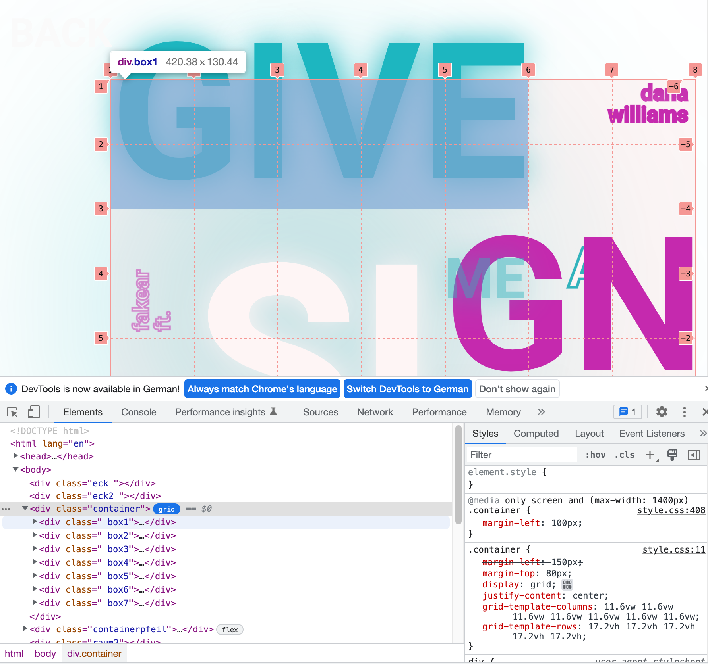
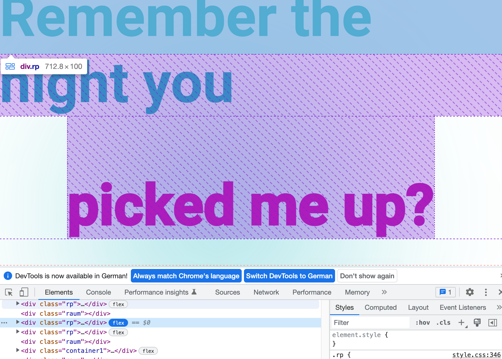
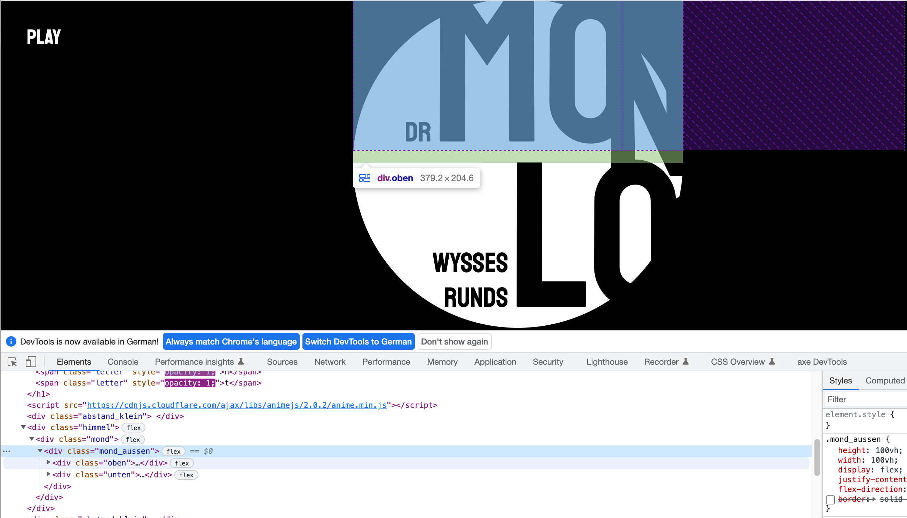

# Grid und Flexbox kombiniert

Flexbox und Grid können kombiniert werden! Ein Beispiel einer Arbeit aus dem letzten Jahr: 
https://hzuellig.github.io/sfgz_gridandmodules/noah/process/tag5/version5.html

## Sektion mit Grid
 

## Sektion mit Flexbox
 

## Ein Beispiel auf Codepen
https://cdpn.io/winkerVSbecks/fullpage/Gmdwxj  

***

# Verschachteln

Die display Properties `flex` und `grid` beziehen sich immer vom Elternelement auf seine direkten Kinder. Sollen die Kindelement eines Kindes sich wieder `flex` oder `grid` -mässig verhalten, so kann man dem wieder die Property zuweisen.

## Flex im Flex
https://hzuellig.github.io/sfgz_gridandmodules/Katrin/  

 