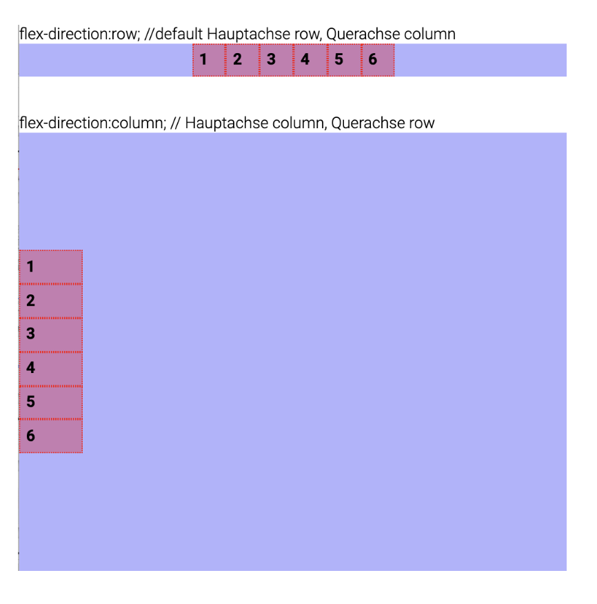
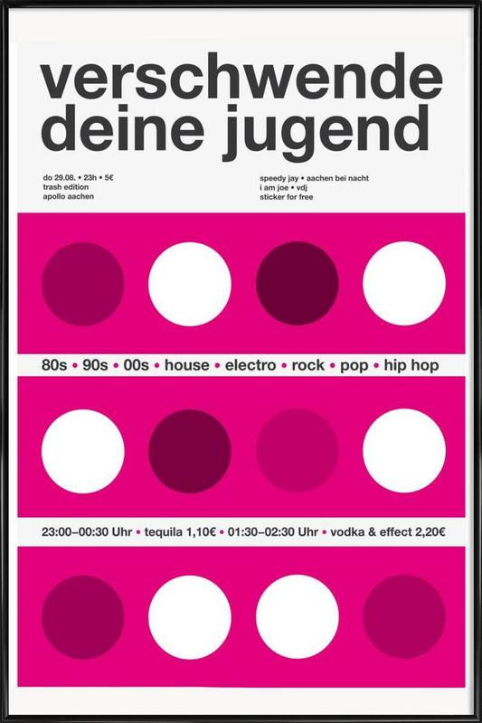

# Einführung Flexbox 
Genau wie bei Grid wird die Property `display:flex` für das Parent Element gesetzt.
```css
.parentcontainer{
    display:flex; 
}
.child{
    border:1px dotted blue;
    padding:1rem;
    margin:1rem;
}
```
```html
<div class="parentcontainer">
    <div class="child">1</div>
    <div class="child">2</div>
    <div class="child">3</div>
    <div class="child">4</div>
</div
```
### flex-direction und Achsen 
Richtung des Layouts: standardmässig werden die Elemente in der Schreibrichtung (bei uns von links nach rechts) ausgelegt. Das ist die Hauptachse. `flex-direction:row` wäre die explizite Angabe dazu. Die Querachse ist dann von oben nach unten.

Mit `flex-direction:column` (beim parentcontainer) ändert ihr die Hauptachse und die Elemente werden in einer Spalte von oben nach unten dargestellt. Die Querachse ist entsprechend von links nach rechts (in der westlichen Schreibrichtung).

<br/><br/>
<br/>

<a href="https://developer.mozilla.org/en-US/docs/Web/CSS/CSS_Flexible_Box_Layout/Basic_Concepts_of_Flexbox" target="_blank">Mozilla Referenz</a>

### justify-content 
Die Property `justify-content` definiert, wie der Browser den Platz zwischen und um Inhaltselemente entlang der Hauptachse eines Flex-Containers verteilt. Ein paar Varianten:
```css
.parentcontainer{
    /* Positional alignment */
    justify-content: center; /* Pack items around the center */
    /* justify-content: start; /* Pack items from the start */
    /* justify-content: end; /* Pack items from the end */
    /* justify-content: space-between; /* Raum gleichmässig zwischen den Items verteilen. Das erste hat links keinen Raum, das letze hat rechts keinen */
}
```
<a href="https://developer.mozilla.org/en-US/docs/Web/CSS/justify-content" target="_blank">Mozilla Referenz</a>

### align-items
Die Property `align-items` definiert, wie der Browser die Inhaltselemente entlang der Querachse eines Flex-Containers verteilt. Ein paar Varianten:
```css
.parentcontainer{
    /* Positional alignment */
    align-items: center; /* Pack items around the center */
    /*align-items: start; /* Pack items from the start */
    /*align-items: end; /* Pack items from the end */
}
```
<a href="https://developer.mozilla.org/en-US/docs/Web/CSS/align-items" target="_blank">Mozilla Referenz</a>
<br/><br/>

Beides kombiniert, die Einmittung entlang der Hauptachse und Querachse, erlaubt, ein Element horizontal und vertikal zu zentrieren. Damit ein Element im Viewport vertikal zentriert wird, muss dem Parent eine Höhe zugewiesen werden. Sonst ist das Parent einfach so gross wie das Kind Element und die Zentrierung ist nicht sichtbar.

```css
.parentcontainer{
    align-items: center; 
    justify-content: center;
    height:100vh;
}
```
## flex-wrap
Standardmässig werden die Items nicht umbrochen. Mit `flex-wrap:wrap` bestimmst du, dass es einen Umbruch gibt, wenn der parentcontainter in der Hautachse gefüllt ist:

```css
.parentcontainer{
    /* wrap? */
    flex-wrap:          nowrap (default)
                        /* wrap */
                        /* wrap-reverse */
}
```
## flex-basis 
Die CSS-Eigenschaft flex-basis legt fest, wie gross die Hauptgrösse eines Flex-Elements ist. Du kannst dir flex-basis in Analogie zu width vorstellen – es legt die Breite fest. Im Unterschied zu width kann flex-basis aber erweitert werden, mit einem Wachstums- und Schrumpfaktor. Damit legst du fest, wie sich das Element verhalten soll, falls mehr oder weniger Platz als die Basis vorhanden ist (eben flexibel :-))

## flex-grow
Die CSS-Eigenschaft flex-grow legt den Flex-Wachstumsfaktor für die Hauptgröße eines Flex-Elements fest.
```css
.child:fist-of-type{
    flex-grow:2;
    background-color:pink;
}
```
Im Überblick:

```css
.container{
    display: flex;
    /* horizontal alignment */
    justify-content:    flex-start (default)
                        flex-end
                        center
                        space-between
                        space-around
                        space-evenly

    /* vertical alignment */
    align-items:        stretch (default)
                        /* flex-start */
                        /* flex-end */
                        /* center */
                        /* baseline */

    /* direction of items */
    flex-direction:     row (default)
                        /* row-reverse */
                        /* column */
                        /* column-reverse */

}
```
```css
.child{
    align-self
    /* override align-items */
    align-self:         stretch
                        /* flex-start */
                        /* flex-end */
                        /* center */
                        /* baseline   */

    /* how much should the div grow? */
    flex-grow:               number
}
```
*** 

## Tutorial Plakate bauen - Flexbox
<br/>
Erstelle einen Folder tag5 und lege eine Datei `ueb-1-plakat-flex.html` an. Lege einen Folder `css` an im Folder tag5 und erstelle dort ein File `style.css`. Im `head` des html Files bindest du die externe css Datei so ein: `<link rel="stylesheet" href="css/style.css">`.

Im style.css kannst du die Farben als CSS Custom Properties definieren: https://developer.mozilla.org/en-US/docs/Web/CSS/Using_CSS_custom_properties
```css
@import url('https://fonts.googleapis.com/css2?family=Roboto:wght@700&display=swap');

:root {
  /* CSS Angaben über Custom Properties definieren, -> zentraler Ort, um Werte zu ändern */
  --white: #fff;
  --background: #e4007b;
  --dark: #6d0039;
  --bright: #c10069;
  --medium: #a00058;
}
```
Für die erste Reihe der Punkte im HTML. Der `section` Tag im HTML ist ein sogenannter semantischer Tag. Das heisst, er hat eine Bedeutung. Seine Bedeutung ist, dass der Content, den er beinhaltet, inhaltlich zusammengehört, nicht nur vom Layout her zusammengefasst wird. 
Um die verschiedenen `section` in einem Dokument zu unterscheiden, könnt ihr je eine Klasse vergeben, hier `dotrow`.
```html
<section class="dotrow">
        <div class="dot"></div>
        <div class="dot"></div>
        <div class="dot"></div>
        <div class="dot"></div>
 </section>
```
Wenn ihr die section mit der Klasse `.dotrow` ansprechen wollt, so schreibt ihr `section.dotrow` ohne Leerschlag zwischen Tag und Klasse. Ihr weist dieser Section die display Property mit dem Wert `flex` zu. Um den Raum rund um die Punkte herum zu verteilen verwendet ihr `justify-content: space-around;`. Für die Hintergrundfarbe die CSS Custom Property, hier gibt es die Schreibweise mit `var()` und dem Namen, den ihr definiert habt. 
Den Punkten geben wir einen `border-radius`, und eine Basis Breite


```css
/*---- Reihen der farbigen Punkte  ----*/

section.dotrow {
    display: flex;
    justify-content: space-around;
    background-color: var(--background);
}

.dot {
    border-radius: 50%;
    flex-basis: 150px;
    height: 150px;
    background-color: var(--white);
}

.dot:nth-of-type(1) {
    /*to do farbe ergänzen */ 
}

.dot:nth-of-type(3) {
     /*to do farbe ergänzen */ 
}

```

Section 2, Infotexte, HTML:

```html
 <section class="infotext">
        <div class="info">80s</div>
        <div class="info">90s</div>
        <div class="info">house</div>
        <div class="info">electro</div>
        <div class="info">rock</div>
        <div class="info">pop</div>
        <div class="info">hip hop</div>

</section>
```
Damit die Texte nebeneinander, aber in der Mitte gelayoutet liegen, wird der `section.infotext` wieder `display: flex;` zugewiesen. `justify-content: center;` verteilt die Elemente von der Mitte her. 

```css
/*------- section infotexte -------*/

section.infotext {
    display: flex;
    justify-content: center;
}

.info {
    padding: 1rem;
    font-family: 'Roboto', sans-serif;
    font-size: 1.5rem;
}


```


*** 
Übungen zu zweit, Task 1-3: https://developer.mozilla.org/en-US/docs/Learn/CSS/CSS_layout/Flexbox_skills<br/><br/>

Übung einzeln: Passe deine Navigation in process/index.html so an, dass die Items über flexbox eingemittet werden. Tipp, Task 1 in der Übung oben beachten!
<br/><br/>
Extended: https://flexboxfroggy.com/#de <br/><br/>

## Aufgabe auf 18.11. 
Den eigenen Entwurf mit flexbox und/oder grid umsetzen. 