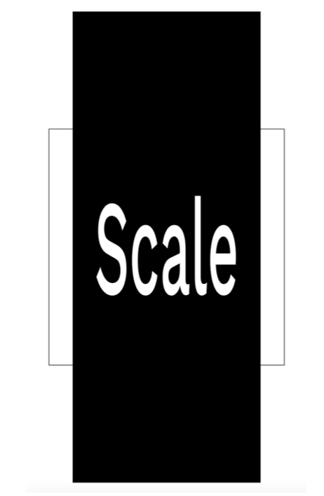
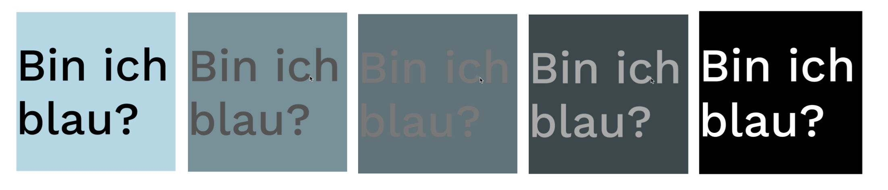

# Programm
Morgen
* Repetition Flexbox (Anna)
* Repetition Grid (Patrick)
* Stand Layout
* CSS Transformationen
* CSS Transitions

Nachmittag
* Layoutentwurf (Besprechungen mit Brigitte)
* Support Umsetzung Sprint 2 bei Hanna, <a href="https://docs.google.com/spreadsheets/d/1GEvCsvgjq62e8O6OYFz_sfzU9AV4ZmoSyefAALEjTnc/edit?usp=sharing" target="_blank">hier eintragen</a>

## CSS Transform
Der CSS-Datentyp `<transform-function>` stellt eine Transformation dar, die das Aussehen eines Elements beeinflusst. Transformationsfunktionen können ein Element im 2D- oder 3D-Raum drehen, in der Größe verändern, verzerren oder verschieben. Er wird in der Eigenschaft `transform` verwendet.<br/> 


```css
  /* Beispiel Verschiebung um 100px in der x-Achse und 200px in der y-Achse */
  transform: translate(100px, 200px);
```

Wir werden nun die 2D Transformationen einzeln anschauen. 
Erstelle einen Folder tag6 und darin ueb1-transform.html
Mach ein Beispiel pro Transformation. Dazu kannst du pro Beispiel jeweils diese Grundstruktur übernehmen.

```html
    <section>
        <h1>Name der Transformation</h1>
        <div class="group">
            <div class="not_transformed">
            </div>
            <div class="transformed">
            </div>
        </div>
    </section>
```
```css 
.group{
    display:grid;
    grid-template-columns: 1fr; 
    grid-template-rows: 1fr; 
}

/* beide elemente liegen ursprünglich übereinander */
.not_transformed,
.transformed {
    grid-column: 1 / 2;
    grid-row: 1 / 2;
    height: 400px;
    width: 400px;
}
/* zur visuellen unterscheidung zwei unterschiedliche stile zuweisen */
        
.not_transformed {
    background-color: black;
}
.transformed {
    background-color: rgba(0, 0, 255, 0.5);
}
      
```

### translate()
Die CSS-Funktion `translate()` positioniert ein Element in horizontaler und/oder vertikaler Richtung neu.<br/> 

```css
/* Ein einziger <length-percentage> Wert gilt für beide Achsen
*/
transform: translate(200px);
transform: translate(50%);

/* Zwei <length-percentage> Werte gelten separat für die x (1.Wert) und y (2. Wert) Achse
*/
  
transform: translate(100px, 200px);
transform: translate(100px, 50%);
transform: translate(30%, 200px);
transform: translate(30%, 50%);
```

In der Anwendung unseres Beispiels:

```css
/* neue Klasse */
.verschoben {
    transform: translate(100px, 200px);
}
```
```html
<div class="transformed verschoben">
 </div>
```
### rotate()
Die CSS-Funktion rotate() definiert eine Transformation, die ein Element um einen festen Punkt auf der 2D-Ebene dreht, ohne es zu deformieren.

```css
/* Beispiel 45 Grad Uhrzeigersinn*/
transform: rotate(45deg);
 
```

### transform-origin
Der Fixpunkt, um den das Element rotiert - wie oben erwähnt - wird auch als Transformationsursprung bezeichnet. Standardmäßig ist dies der Mittelpunkt des Elements, aber du kannst deinen eigenen Rotationsursprung mit der Eigenschaft transform-origin festlegen.

```css
/* Beispiel linke obere Ecke*/
transform-origin: top left;
/* Beispiel linke obere Ecke*/
transform-origin: 50px 50px;
```

Probiere beides, einmal ohne Setzung von `transform-origin`, einmal mit. 

### scale()
Die CSS-Funktion scale() definiert eine Transformation, die ein Element auf der 2D-Ebene skaliert. 

```css
  /*Beispiel beide Achsen gleich skaliert*/
  transform:scale(0.8); 
  /*Beispiel beide Achsen unterschiedlich skaliert*/
  transform:scale(0.8, 2);
```
<br/>
Schreibe ein Wort in die transformierte Box und beachte, wie die Funktion alle Properties skaliert, auch die Schrift (auch allfällige Kinder). 

### skew()
Diese Transformation ist eine Verzerrung, die jeden Punkt innerhalb eines Elements um einen bestimmten Winkel in horizontaler und vertikaler Richtung verzerrt. Der Effekt ist so, als ob du jede Ecke des Elements anfassen und sie entlang eines bestimmten Winkels ziehen würdest.
`skewX` in der x-Richtung, `skewY` in der y-Richtung, `skew` in beiden Richtungen. Die Angaben erfolgen in Grad (10deg).

```css
 transform:skewX(10deg); 
 transform:skew(20deg, 10deg);
```

## Kombination von mehreren Transformationen auf einem Element
Die Kombination von verschiedenen transformationen schreibt ihr hintereinander in einen einzige transform Angabe.
Bei der falschen Schreibweise oben würde bloss rotate ausgeführt, weil die Angabe scale überschreibt – sie kommt nachher (Cascading Rules).

```css
/* Falsch !!*/
  transform:scale(0.8); 
  transform:rotate(45deg);
/* Richtig !!*/
  transform:scale(0.8) rotate(45deg);
```

Alle im Überblick: https://developer.mozilla.org/en-US/docs/Web/CSS/transform 


<br/>

### Üben
Zur Repetition: Arbeitet euch durch die 4 Übungen hier 
https://www.w3schools.com/css/exercise.asp?filename=exercise_css3_2dtransforms1
<br/>
Setze mal die drei `S` auf diesem Plakat, indem du zuerst alle an dieselbe Position bringst (wie oben) und dann zwei davon verschiebst. 
Den Effekt der Farbmischungen bekommst du übrigens über `mix-blend-mode`, https://developer.mozilla.org/en-US/docs/Web/CSS/mix-blend-mode

```css

.letter{
    mix-blend-mode: multiply;
}

```

## Transition Übergangseffekte
<br/>

Um zu verstehen, welche Funktion die `transition` Angaben haben, ein Beispiel einer Zustandsveränderung ohne `transition`.
Erstelle ein neues File `ueb2-transition.html` im Folder tag6.
Kopiere die HTML `section` die du für die obigen Beispiele verwendet hast, in dieses neue File. 
Im CSS Style schreibst du:

```css
.transformed { 
    height: 500px; 
    background-color:lightblue; 
    
} 

.transformed:hover{ 
    /* Veränderter Zustand */
    background-color:black; 
    transform: translate(100px, 200px);
}
```
Du wirst feststellen, dass der Zustandswechsel abrupt vollzogen wird – ohne Übergang. `:hover` ist übrigens eine sogenannte Pseudoklasse. Eine CSS-Pseudoklasse ist ein Schlüsselwort, das zu einem Selektor hinzugefügt wird und einen speziellen Zustand des/ der ausgewählten Elements/Elemente angibt. `:hover` bedeutet, der Mauszeiger des Benutzers liegt auf diesem Element – dann tritt es in diesen Zustand. <br/>
Übersicht über alle Pseudoklassen:
https://developer.mozilla.org/en-US/docs/Web/CSS/Pseudo- classes

### transition-property
Die CSS-Eigenschaft transition-property legt die CSS- Eigenschaften fest, auf die ein Übergangseffekt angewendet werden soll. 

```css
/* Beispiele */

 transition-property: none;
 transition-property: all;
 transition-property: font-size;
 
```

Mit none wird keine der Eigenschaften per Übergang verändert. Folge, harter Wechsel von einem Zustand in einen anderen.
Mit all werden alle Eigenschaften per Übergangseffekt verändert.
Mit der Angabe einer spezifischen Property (Bsp. font-size) wird eine Änderung dieser Angabe mit einem Übergangseffekt verändert. Alle anderen Properties würden sich ohne Übergang verändern.<br/><br/>

### transition-duration
Die CSS-Eigenschaft "transition-duration" legt fest, wie lange eine Übergangsanimation dauern soll, bis sie abgeschlossen ist. Standardmäßig ist der Wert 0s, was bedeutet, dass keine Animation stattfindet. Die Zeitangabe kann in s für Sekunden oder ms für Millisekunden gemacht werden.

```css
/* Beispiel eine halbe Sekunde Dauer */
transition-duration: 500ms;
```

### transition-timing-function
Die CSS-Eigenschaft transition-timing-function legt fest, wie Zwischenwerte für CSS-Eigenschaften berechnet werden, die von einem Übergangseffekt betroffen sind. 
https://developer.mozilla.org/en-US/docs/Web/CSS/transition- timing-function 

```css
/* ein paar Beispiele */
transition-timing-function: linear;
transition-timing-function: ease;
transition-timing-function: ease-in;
transition-timing-function: ease-out;
transition-timing-function: ease-in-out;

transition-timing-function: cubic-bezier(0.1, 0.7, 1, 0.1);

```

Ergänzung zu Cubic Bézier: auf dieser Seite kannst du deine eigene Animationskurve erstellen: https://cubic-bezier.com

### transition-delay
Die CSS-Eigenschaft transition-delay gibt die Dauer an, die gewartet wird, bevor der Übergangseffekt einer Eigenschaft gestartet wird, wenn sich ihr Wert ändert.

```css
/* Beispiel eine Sekunde Verzögerung */
transition-delay: 1s;
```

### transition

Die CSS-Eigenschaft "transition" ist eine Kurzform für "transition-property", "transition-duration", "transition-timing- function" und "transition-delay" (Angaben in dieser Reihenfolge).

```css
transition: all 0.5s ease-out 1s;
```


Die Transition Properties müssen im Default State des Elements definiert werden, nicht im veränderten State! Wenn ihr sie im veränderten State definiert, wird nur der Weg von kein Hover zu Hover animiert sein, der Weg zurück nicht (ausprobieren).

```css
.transformed { 
    height: 500px; 
    background-color:lightblue; 
    transition: all 0.5s ease-out 1s;
} 

.transformed:hover{ 
    /* Veränderter Zustand */
    background-color:black; 
    transform: translate(100px, 200px);
}
```

### Üben
Arbeite dich zur Repetition durch diese Übungen durch: https://www.w3schools.com/css/exercise.asp?filename=exercise_css3_transitions1 <br/><br/>

Animiere die drei S aus der Übung oben. Die Bewegung soll erst dann stattfinden, wenn die User mit der Maus über dem Grid `.group` fahren. 
Tipp:

```css
/* so sprichst du das erste element mit der Klasse .letter innerhalb von .group an, falls der Mauszeiger über .group schwebt */
.group:hover.letter:nth-of-type(1) {
    transform: translate(-20px, 0);
}
```