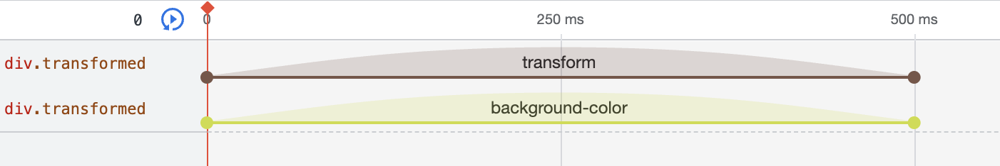
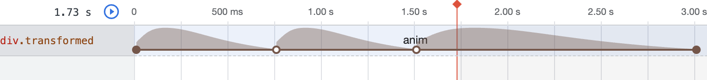
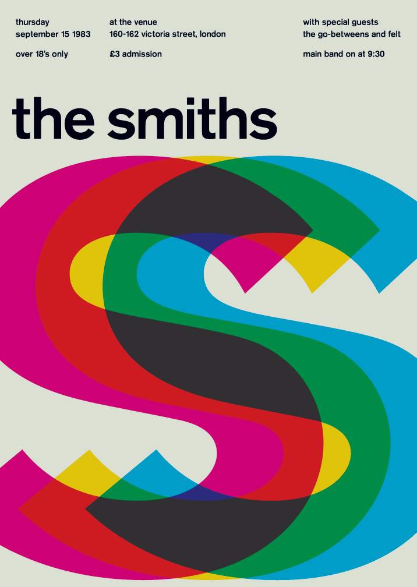
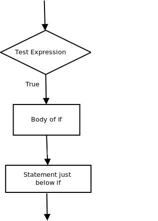
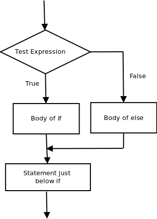

# Programm
Morgen
* CSS Animationen
* HTML Events und JavaScript 

Nachmittag
* Arbeitszeit und Support
* Besprechungen und Feedbacks in Gruppen 
* Inspirierende Projekte, Sharing (Scrollytelling)
* Putzen: Gesamtprojekt aufräumen, Übungen verlinken, Push auf Github

Beispiel Studentenarbeit animierte Plakate: <br/>
https://maxwerner-kickweb.netlify.app/plakat/sprint3/plakat

## Was sind CSS Animationen?
CSS Animationen sind mächtiger als Transitions. Im Unterschied zu Transitions können bei Animationen nicht nur Zustand A und Zustand B definiert werden, sondern X Zustände dazwischen, sogenannten Keyframes. 
<br/>
Eine Transition geht von Zustand A zu Zustand B. In den Developer Tools von Google Chrome könnt ihr über den Tabulator 'Animations' die Form der Animation anzeigen lassen.<br/>

<br/>

Im Unterschied dazu können bei Animationen viele Zustände definiert werden. Die Darstellung einer Animation mit Keyframes bei 0%, 25% und 50% sieht so aus:
<br/>

<br/>

## Wie sieht die Syntax aus?
Mit dem Schlüsselwort `@keyframes` wird eine Animation definiert. In der folgenden Namensgebung seid ihr frei (hier im Beispiel slidein).
In den geschweiften Klammern werden die Zustände der Properties zum Zeitpunkt der einzelnen Keyframes definiert. from ist der Keyframe zu 0%
to der zu 100%. Alternativ können auch die Prozente angegeben werden. 
Bei jedem Keyframe wird ein weiterer Block über die geschweiften Klammern geöffnet, dort schreibt ihr die CSS Eigenschaften, die ihr verändern und animieren wollt. Im Unterschied zu `transition` müsst ihr bei den Animationen über `@keyframes` nicht extra angeben, dass die Eigenschaften mit Übergangseffekten verändert werden. 

```css
/*Animation entwerfen*/
@keyframes slidein {
 from {
    transform: translateX(0%);
 }
 to {
    transform: translateX(100%);
 }
}
/*Animation zuweisen*/
.animierteklasse{
    animation-name:slidein;
    animation-duration:3s;
}
```
`animation` hat weitere Eigenschaften, über die gesteuert werden kann, wie eine Animation abläuft.

```css
.animierteklasse{
   animation-delay: 1s; /* Verzögerung */
   animation-iteration-count: 2; /* Wie oft die Animation abgespielt wird, default 1 Mal*/
   animation-direction: alternate;
   /*
   Mögliche Werte
   normal -> 
   Die Animation wird bei jedem Zyklus vorwärts abgespielt. Mit anderen Worten: Bei jedem Zyklus wird die Animation auf den Anfangszustand zurückgesetzt und beginnt von vorne. Dies ist der Standardwert. 
 
   reverse ->
   Die Animation wird bei jedem Zyklus rückwärts abgespielt. Mit anderen Worten: Bei jedem Zyklus wird die Animation zum Endzustand zurückgesetzt und beginnt von vorn. Die Animationsschritte werden rückwärts ausgeführt, und auch die Zeitfunktionen werden umgekehrt. 

   alternate ->
   Die Animation kehrt bei jedem Zyklus die Richtung um, wobei die erste Iteration vorwärts abgespielt wird. Die Zählung zur Bestimmung, ob ein Zyklus gerade oder ungerade ist, beginnt bei eins.

   alternate-reverse ->
   Die Animation kehrt bei jedem Zyklus die Richtung um, wobei die erste Iteration rückwärts abgespielt wird. 
   */
   animation-timing-function: ease-in-out;
   /* (Diese Eigenschaft entspricht transition-timing-function)
   Art und Weise wie die Übergänge gerechnet werden 
   https://developer.mozilla.org/en-US/docs/Web/CSS/animation-timing-function*/
   animation-fill-mode: forwards;
   /* 
   Werte 
   forwards -> 
   Das Element behält den Endzustand nach Abspielen der Animation. (Oft ist das der gewünschte Zustand)
   Mehr Settings: https://developer.mozilla.org/en-US/docs/Web/CSS/animation-fill-mode
   */
   animation-play-state: paused;
   /*Werte 
   paused 
   running
   Bei der Wiederaufnahme einer angehaltenen Animation wird die Animation an der Stelle fortgesetzt, an der sie zum Zeitpunkt der Unterbrechung unterbrochen wurde, anstatt am Anfang der Animationssequenz neu zu beginnen.
   */

}
```

Die CSS-Eigenschaft `animation` ist ein Kürzel für alle Properties `animation-name`, `animation-duration`, `animation-timing-function`, `animation-delay`, `animation-iteration-count`, `animation-direction`, `animation-fill-mode` und `animation-play-state`. 

```css
/* @keyframes duration | easing-function | delay |
iteration-count | direction | fill-mode | play-state | name */
animation: 3s ease-in 1s 2 reverse both paused slidein; 
```

### Üben
Arbeite dich zur Repetition durch diese Übungen durch: https://www.w3schools.com/css/exercise.asp?filename=exercise_css3_animations1 <br/><br/>
<br/>

Mache eine Kopie der Übung mit den drei S von Tag6. <br/> Generiere pro Buchstabe eine Animation, die dreimal wiederholt wird und dann auf dem Endpunkt stehen bleibt. Tipp: `animation-fill-mode: forwards;` 
Welche Eigenschaften willst du animieren? Farbe, Transparenz, Position?


# HTML Events 
Was ist ein HTML Event?
HTML bietet die Möglichkeit, durch Ereignisse (Events) Aktionen im Browser auszulösen, z. B. ein JavaScript zu starten, wenn ein Benutzer auf ein Element klickt. In der Übung unten wird auf das `onclick` Event JavaScript aufgerufen. (JavaScript erstellt über die `alert` Funktion ein PopUp Fenster)<br/>
Weitere Events: <br/>
`onresize` Wenn man das Browserfenster vergrössert oder verkleinert<br/>
`onload` Wenn die ganze Page gelanden ist<br/>
Noch mehr:
https://www.w3schools.com/tags/ref_eventattributes.asp

# JavaScript
## Eine erste Übung. 
- Erstelle ein File `ueb1_jsintro.html` im Folder tag7 und darin einen Button:

```html
<button class="specialbutton">Klick Mich!</button>
```

- Style deinen Button mit CSS, Beispiel
```css
.specialbutton {
    background-color: #44c767;
    border-radius: 28px;
    border: 1px solid #18ab29;
    display: inline-block;
    cursor: pointer;
    color: #ffffff;
    font-family: Arial;
    font-size: 17px;
    padding: 16px 31px;
    text-decoration: none;
    text-shadow: 0px 1px 0px #2f6627;
}

.specialbutton:hover {
    background-color: #5cbf2a;
}
```
– Das Klick Event mit JavaScript abfangen
```html
<button class="specialbutton" onclick="javascript:alert('hihi')">Klick Mich!</button>
```
– JavaScript wo einbinden? Zwei weitere Möglichkeiten. Die letzte ist die, welche für grössere Projekte empfohlen wird. <br/>
Var 1. Füge diesen HTML Script Tag im HTML head oder im body ein:<br/>
```html
<script>
    alert('hallo seite geladen');
</script>
```
Var 2. Im script.js (lassen wir heute aus)
```
directory_name/
    - index.html
    - assets/
        - style.css
        - js/
            - scripts.js
```
Im script.js. Mit dem Befehl console.log() kannst du in der Konsole etwas ausgeben lassen, Bsp. einen Wert von einer Variable. 
```js
console.log('hallo von extern')
```
Bevor der Body schliesst, einbinden
```html
<script src="assets/js/script.js"></script>
```

Wir werden nun einen CSS Stil über JavaScript (JS) verändern. 
Dazu müssen wir per JS das gewünschte Element ansprechen. Für diesen Zweck gibt es das DOM -> Document Object Model. Das DOM ist eine Abbildung des ganzen HTML Baums mit allen Knoten für JS. <br/>
<br/>
Quelle: https://www.w3schools.com/js/js_htmldom.asp<br/>
Jeder sogenannten 'Knoten' und jedes Attribut kann über JS angesprochen und verändert werden.
Ein Beispiel, wir setzen einen CSS Stil per JS. Erstelle im HTML ein Element mit der ID `kreis` und gib ihm ein paar CSS Stile.
```html
 <div id="kreis"></div>
```

```css
 #kreis {
            border-radius: 50%;
            width: 400px;
            height: 400px;
            background-color: #000506;
        }
```
Nun greifen wir über das DOM auf das Element kreis zu und verändern das CSS Attribut `background-color` über JS. 
```html
<script>
   function changeProperties(){
      let kreis = document.getElementbyId('kreis');/* Zugriff auf das Element kreis */
      kreis.style.backgroundColor = "red";/* Verändern des CSS Attributs */
   }
    
</script>
```
Auf die CSS Attribute greifst du in dieser Schreibweise zu (Muster): `element.style.nameProperty`
Die Namen der Property sind in JS für einzelne Begriffe wir `border`, `color` gleich wie im CSS. Also `element.style.color` oder `element.style.color`. Für CSS Properties mit Bindestrich wie `background-color`, `border-radius`, `animation-name` gilt, dass das erste Wort klein geschrieben ist und das zweite gross und ohne Bindestrich direkt an das erste Wort gesetzt wird. <br/>
Also:<br/>
CSS `background-color` -> JS `backgroundColor` <br/>
CSS `animation-name` -> JS `animationName` <br/>
Eine Übersicht findest du hier: https://www.w3schools.com/jsref/dom_obj_style.asp

### Kurzübung 
Verändere drei weitere CSS Eigenschaften von `kreis` über die Funktion `changeProperties()`. 

### CSS Animation über JS starten 
Wir werden nun eine CSS Animation über JavaScript starten.
– CSS Animation erstellen mit dem Schlüsselwort `@keyframes`, und ein neues Element, das wir animieren werden, zum Beispiel:

```css 
@keyframes anim {
            0% {
                box-shadow: 0px 0px 8px 8px #e803ba;
            }
            25% {
                box-shadow: 0px 0px 0px 8px #e803ba, 0px 0px 8px 16px #e8035b;
                background-color: #03e8ba;
            }
            50% {
                box-shadow: 0px 0px 0px 8px #e803ba, 0px 0px 0px 16px #e84803, 0px 0px 8px 24px #e85f03;
                background-color: #038ce8;
            }
            75% {
                box-shadow: 0px 0px 0px 8px #e803ba, 0px 0px 0px 16px #e84803, 0px 0px 0px 24px #e85f03, 0px 0px 8px 32px #e8a303;
            }
        }
#kreis2 {
            border-radius: 50%;
            width: 400px;
            height: 400px;
            background-color: #000506;
            
        }

```
Nun weisen wir `#kreis2` die Animation zu, wir wollen aber, dass sie noch nicht startet. Dazu kannst du den `animation-play-state: paused;` setzen. 

```css 
            animation-name: anim;
            animation-duration: 4s;
            animation-iteration-count: 1;
            animation-fill-mode: forwards;
            animation-play-state: paused;
````
Wir werden nun einen Button erstellen und über Klick die Animation starten:

```html
 <button class="specialbutton" onclick="starteAnimation()">Animiere den Kreis</button>

```
```html
    <script>
        function starteAnimation() {
            let element = document.getElementById('kreis2');
            element.style.animationPlayState = "running";
         
        }
    </script>
```

## Events über JS triggern
In unseren Beispielen haben wir das Event `onclick` auf einen HTML Button gesetzt und über HTML getriggert (=ausgelöst). Man kann Events aber auch über JavaScript triggern. Im Beispiel wollen wir die Animation nicht nur über den Button starten, sondern auch dann, wenn die User zu scrollen beginnen. In JavaScript sieht das so aus: 
```html
<script>
   window.addEventListener("scroll", starteAnimation);
</script>

```
https://www.w3schools.com/jsref/dom_obj_event.asp

***

# Material für Selbststudium freiwillig
## Eine Animation starten, wenn ein Element im Viewport erscheint 

Variante pures JavaScript (Vanilla JS), über die Methode `getBoundingClientRect()` https://developer.mozilla.org/en-US/docs/Web/API/Element/getBoundingClientRect 

<br/>
<br/>
Quelle: https://developer.mozilla.org/en-US/docs/Web/API/Element/getBoundingClientRect <br/>

Über die Methode kann abgefragt werden, ob die obere Kante eines Elements im Viewport sichtbar ist:

```html
<script>
        document.addEventListener("scroll", listen);

        function listen() {
            let element = document.getElementById('kreis');
            let rect = element.getBoundingClientRect();
            if (rect.y > 0 && rect.y < window.innerHeight) {
                console.log('obere kante sichtbar');
                /* Hier kann die Animation gestartet werden */
               element.style.animationPlayState = "running";
            }else{
                console.log('obere kante nicht sichtbar');
                 /* Hier kann die Animation gestoppt werden */
                 element.style.animationPlayState = "paused";
            }
        }
    </script>

```
Im Detail, die JavaScript `if` Bedingung prüft, ob etwas zutrifft. Dabei kann eine einzelne Bedingung geprüft werden, oder mehrere. Die Zeilen mit der `if` Bedingung prüft:<br/>
1. Ob die obere Kante des Objekts nicht im Negativbereich des Fensters liegt. Wenn sie das wäre, wäre sie oben heraus gescrollt.<br/>
2. Ob die y Position der oberen Kante des Objekts bereits im Fenster liegt. Falls die y Position grösser ist als die Höhe des viewports, liegt sie noch unterhalb, ausserhalb des sichtbaren Bereichs.<br/>
Beide Bedingungen zusammen stellen sicher, dass die obere Kante im sichtbaren Bereich liegt. 

```html
<script>
         if (rect.y > 0 && rect.y < window.innerHeight) {
                console.log('obere kante sichtbar');
            }
</script>
```

## Erklärungen zu Bedingungen (Conditions)
Das Schlüsselwort bei Bedingungen ist ```if``` 
In einem Schema wird das so darstellt:<br/>
<br/>
Dabei wird die Test Expression ausgewertet, ist sie 'wahr' (true) wird der 'Body of if' ausgeführt. Falls nicht wird er einfach übersprungen und beim 'Statement just below if' weitergemacht.

Allenfalls gibt es ein ```else```, im Schema:<br/>
<br/>
Dabei wird die Test Expression ausgewertet, ist sie 'wahr' (true) wird der 'Body of if' ausgeführt. Falls nicht wird (anders als oben) in den Ast von 'false' gewechselt und 'Body of else' ausgeführt. Beide Äste vereinen sich dann beim 'Statement just below if'.

Wie sieht das im Code aus? 
Struktur:
```js
//nur if
if(/*hier kommt die Testexpression rein*/){
    /*
    Hier kommt body of if eingerückt, damit man es besser lesen kann
    */
}
/* Hier ist das Statement below if*/


//if und else
if(/*hier kommt die Testexpression rein*/){
    /*
    Hier kommt body of if eingerückt, damit man es besser lesen kann
    */
}else{
    /*
    Hier kommt body of else eingerückt, damit man es besser lesen kann
    */
}
/* Hier ist das Statement below if*/
```

## Entscheidungen: die Test Expression
```js
> // grösser als 
< // kleiner als
>= //grösser oder gleich
<= //kleiner oder gleich
== // genau gleich, zwei Gleichheitszeichen
!= // ungleich
|| // oder Verknüpfung, von den so verknüpften Bedingungen muss nur eine wahr sein
&& // und Verknüpfung, alle so vernüpften Bedingungne müssen wahr sein

let n=3;
if(n<5){
    console.log('Bedingung wahr')
}else{
    console.log('Bedingung falsch')
}

let m=9;
//hier wird jede Bedinung für sich ausgewertet und dann logisch zusammengesetzt
//n<5 -> ist wahr
//m>10 -> ist falsch
// weil die Bedigungen mit && UND zusammengesetzt sind, müssten BEIDE wahr sein, um wahr zu ergeben 
if(n<5 && m>10){ 
    console.log('Bedingung wahr')
}else{
    console.log('Bedingung falsch')
}
``` 

## Scrolling Libraries 
Für mehr Funktionen gibt es JavaScript Libraries, über die sich eine Animation sehr präzise über das Scrollen steuern lässt:
Scrollama <br/>
https://github.com/russellsamora/scrollama <br/>

GSAP<br/>
Greensock https://greensock.com/docs/<br/> 
ScrollTrigger Plugin für GSAP: https://greensock.com/docs/v3/Plugins/ScrollTrigger?ref=7856eb
