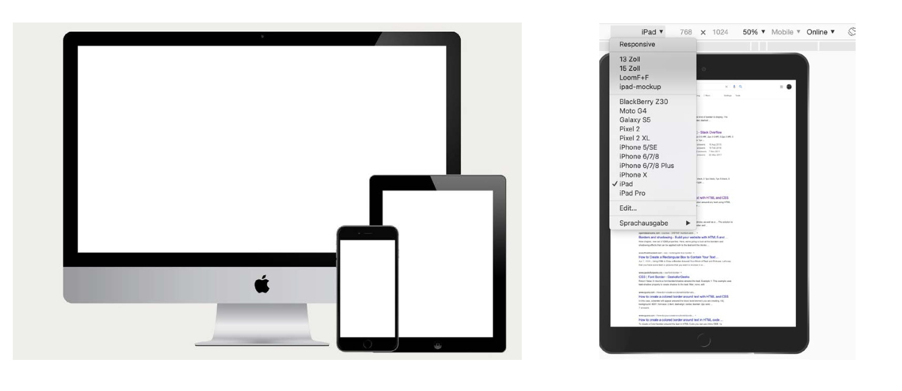

# Responsiveness 
Worum geht es? <br/>

Das Konzept zu Responsive Web Design stammt von Ethan Marcotte.
Er schrieb im Jahr 2010 einen Artikel auf Alistapart mit dem Titel «Responsive Web Design». https://alistapart.com/article/responsive-web-design <br/>
Die Konzepte, die in diesem Artikel formuliert wurden – media queries und darauf basierend CSS Angaben für gewisse Gerätebreiten – sind heute noch gültig.<br/>
Responsiveness wurde immer wichtiger, heute kommt oft der grösste Teil des Traffics von Besuchern mit mobilen Geräten. 2015 begann Google Websites zu degradieren, die nicht responsiv sind.<br/>

## Breakpoints und Fluidität des Layouts
### Breakpoints
«Breakpoints» sind Grenzen, an denen sich das Layout ändert. Meistens werden diese Grenzen
in Abhängigkeit von der Device Breite definiert. Ihr seht in Mockups oft drei Devices; Desktop, Tablet hoch und Mobile. Die Breakpoints, die sich eingebürgert haben sind:
– Desktop 13Zoll 1024pixel -> Angabe 64em
– Tablet hoch 768pixel -> Angabe 48em
– Mobiles unter 640Pixel -> 40em
Wenn ihr im Chrome auf die Developer Tools umschaltet, könnt ihr einzelne voreingestellt Grössen anschauen oder eigene Grössen eingeben.

<br/>

<br/>

### Fluide
Fluidität bedeutet, das Layout so zu bauen, dass die Elemente sich dem Browserfenster anpassen können, wenn man das Fenster vergrössert/verkleinert oder das Device dreht. Konzepte dazu sind Angaben in Prozent oder Viewport Width/Height (vw,vh) oder auf Flexbox mit seinen Properties `flex-wrap` oder `flex-shrink`, `flex-grow`, `flex-basis`.

### Media Queries 
Was sind Media Queries? Innerhalb eine Media Query kann CSS definiert werden, das bloss dann gilt, wenn die Bedingungen der Query erfüllt sind. Ein Beispiel:
```css
body {
    background-color: black;
  }
@media all and (max-width: 600px) {
  body {
    background-color: lightblue;
  }
}
```
Der background ist auf grossen Screens schwarz (erste Anweisung ohne Media Query). Auf einem kleinen Screen (bis zu einer Breite von 600px) ist der Background hellblau.
<br/>
Auf cssmediaqueries findest du eine Auflistung vieler Queries. Du siehst auch gleich, welche für dein Ausgabemedium greifen würden: http://cssmediaqueries.com/overview.html<br/>

Wo soll man Breakpoints setzen/testen?<br/>
Als 'Daumenregel' könnt ihr diese Breakpoints berücksichtigen, sie entsprechen denen, die CSS Frameworks (Tailwind) benutzen. Die Logik der Frameworks folgt von unten nach oben (mobile first)<br/>

| Grösse  |      Width     |  Query |
|----------|:-------------:|------:|
| default | mobile | CSS ohne media query | 
| small | mindestens 640px breit | `@media (min-width: 640px) { ... }`| 
| md | mindestens 768px breit | `@media (min-width: 768px) { ... }`| 
| lg | min. 1024px breit | `@media (min-width: 1024px) { ... }`| 
| xl | min. 1280px breit | `@media (min-width: 1280px) { ... }`| 
| 2xl | min. 1536px breit | `@media (min-width: 1536px) { ... }`| 

### Beispiele
```css
/* If the screen size is 640px wide or more, use flexbox */
@media screen and (min-width: 640px) { 
    div.example {
        display: flex; }
    }
```

```css
/* Default h1 is 1.2rem, if the screen size is 1024px wide or more change fontsize to 2rem  */
h1{
    font-size:1.2rem;
}
@media screen and (min-width: 1024px) { 
    h1 {
        font-size:2rem; 
        }
}
```

### Examples Responsive Flexbox Layouts
https://www.quackit.com/css/flexbox/tutorial/create_a_responsive_flexbox_layout.cfm

### Übung 
1. Baut auf eurer Verlinkungsseite mindestens eine Media Query ein. Benutzt dabei die Breakpoints, die ich euch angegeben habe. <br/>

2. Ändert das Layout auf Geräten unter 769px auf ein einspaltiges Layout. 
Die Media Query von oben her gesehen (Desktop first) würde so lauten:<br/>

```css
@media screen and (max-width: 768px) { 
    .parent {
        display:block;
        }
}

```

### Testing 
<a href="ResponsivenessTesting.md">Ergänzendes Material Responsiveness Testing</a>